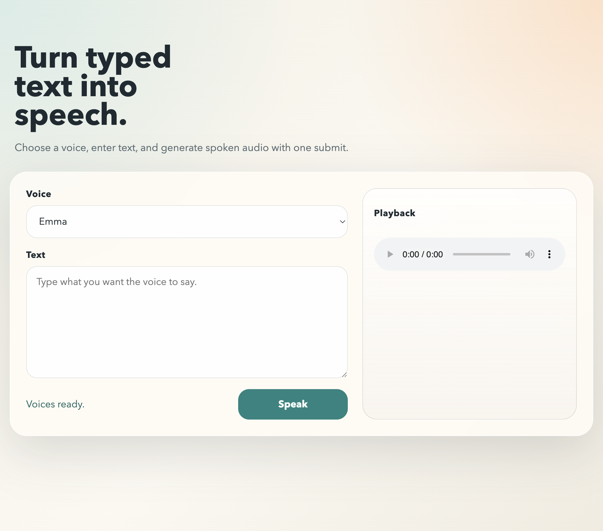

# text-to-speech

Small local text-to-speech app using the Coqui VCTK voice set.

## Preview



## What it does

- Loads available voices into a dropdown
- Lets the user type text in a textarea
- Generates spoken audio after submit
- Plays the WAV result in the browser and allows download

## Project structure

```text
text-to-voice/
├── backend/
│   ├── main.py
│   └── requirements.txt
├── web/
│   ├── app.js
│   ├── index.html
│   └── styles.css
└── README.md
```

## Run locally

### Fast start (one command)

```bash
./start.sh
```

This starts:

- Backend at `http://localhost:8000`
- Frontend at `http://localhost:8080`

Press `Ctrl+C` once to stop both.

### 1. Start the backend

```bash
cd backend
python3 -m venv venv
source venv/bin/activate
pip install -r requirements.txt
python main.py
```

The API runs at `http://localhost:8000`.

### 2. Start the frontend

```bash
cd web
python3 -m http.server 8080
```

Open `http://localhost:8080` in the browser.

## API

### `GET /voices`

Returns the available VCTK speaker choices grouped by gender.

### `POST /text-to-speech`

Request body:

```json
{
  "text": "Hello from the text to voice app",
  "voice": "amy_f"
}
```

Response: `audio/wav`
